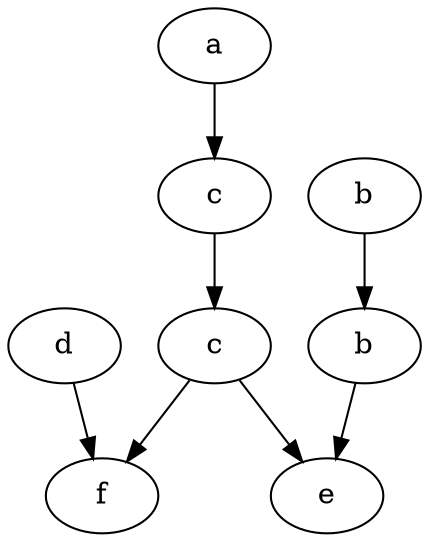

# Praktyczne wykorzystanie teorii śladów

## Działanie programu
Program wyznacza relację zależności D, relację niezależności I, postać normalną Foaty FNF śladu w
oraz rysuje graf zależności w postaci minimalnej dla słowa w.
Robi to dla każdego zadanego alfabetu, zestawu transakcji i słowa w.

## Dane
Program przyjmuje listę transakcji w formie plaintext. Adres do pliku zawierającego transakcje podaje w
stałej `const std::string INPUT_FILE` znajdującej się na samym początku pliku main.cpp.
Przykładowa lista transakcji znajduje się w pliku `transactions.txt`.
Każda transakcja ma formę:
```
(a) x := y + z - c + 3d
```
Gdzie "a" to jednoliterowa nazwa transakcji, x to wynik a ciąg znaków po ":=" jest dowolny. Jednak istotne jest,
że zmienne w transakcjach powinny być literami.

Słowo podaje się w zmiennej `const std::string WORD`. Alfabet zaś w `const std::set ALPHABET`.
Gdy program obliczy graf Diekerta, zapisze go w formacie .dot do pliku `const std::string OUTPUT_FILE`.

## Zależności
Program do wykonania wymaga wersji cmake minimum 3.21. Napisany został w języku C++20 (co należy uwzględnić,
bo część użytych funkcji pochodzi z nowszych wersji C++).

## Kompilacja i wykonanie - Linux
Żeby skompilować program, należy (będąc w katalogu głównym) wykonać polecenia:
```bash
mkdir build
cmake -B./build -S.
cd build
make
```

Żeby go uruchomić, należy będąc w katalogu `build`, uruchomić polecenie:
```bash
./trace
```

Graf w formacie .dot pojawi się zaś jako plik output.dot w głównym folderze.

## Ogólna struktura projektu
Pliki nagłówkowe wykorzystywane przez program znajdują się w folderze `include`.
Są tam wszystkie definicje struktur i funkcji wykorzystywanych przez program.
Ich implementacje znajdują się w katalogu `src`.
Punkt wywołania programu napisany jest w pliku `main.cpp`, konfiguracja w `CMakeLists.txt`.
## Parsowanie transakcji
Funkcje odpowiedzialne za czytanie transakcji z pliku znajdują się w module `transaction.h`.
W szczególności istotne są funkcje:

```cpp
Transaction Transaction::readTransaction(const std::string& line) {
    Transaction transaction;
    if(line.length() < 9) {
        throw std::invalid_argument("Transaction too short: " + line);
    }
    if(line[0] != '(' || line.substr(2, 2) != ") "
        || line.substr(5, 3) != " :=") {
        throw std::invalid_argument("Invalid transaction format: " + line);
        }
    if(!isalpha(line[4])) {
        throw std::invalid_argument("Transaction result should be a letter: " + line);
    }
    transaction.id = line[1];
    transaction.result = line[4];
    for(int i = 8; i < line.length(); i++) {
        if(isalpha(line[i])) {
            transaction.dependencies.insert(line[i]);
        }
    }
    return transaction;
```
Funkcja czyta pojedyczną transakcję z jednej linii w pliku. O tyle warto było ją pokazać,
żeby było jasne, w jaki sposób powinno się zapisywać transakcje w pliku. Liczba znaków po lewej stronie równania
(tam gdzie znajduje się id transakcji i wynik, np `(a) x :=`) powinna być zawsze taka sama.
Ciąg znaków po prawej stronie jest dowolny, ale tylko pojedyncze znaki mają znaczenie.
Z tego wynika też, że ciąg `xyz` po prawej stronie będzie interpretowany jako zależność od `x`, `y` i `z`.

```cpp
bool Transaction::areDependent(const Transaction &first, const Transaction &second) {
    return first.dependencies.contains(second.result)
        || second.dependencies.contains(first.result);
}
```
Sprawdzenie czy dwie transakcje są od siebie zależne polega na sprawdzeniu, czy wynik którejkolwiek z nich
zawiera się w zbiorze zależności tej drugiej.

```cpp
// get all transactions from the file mapped by their ids
static std::map<char, Transaction> getTransactions(const std::string& path,
                                                   const std::set<char>& alphabet);
```

Najważniejszą funkcją jest `getTransactions` która zwraca słownik transakcji. Kluczami są ich identyfikatory.
To oznacza też, że identyfikatory są unikalnymi znakami, nie mogą się powtarzać (bo transakcja się zgubi).

## Grafy
Struktury potrzebne do implementacji grafów znajdują się w module `graphs.h`.

### Ogólna implementacja
```cpp
struct Node {
    char transactionID;
    std::vector<int> neighbors;
};
```
Grafy ogólnie zaimplementowano za pomocą list sąsiedztwa. Wierzchołek składa się z identyfikatora jego transakcji
oraz listy indeksów jego sąsiadów. W ten sposób można zaimplementować zarówno graf skierowany, jak i nieskierowany.

```cpp
struct Graph {
    std::vector<Node> nodes;

    // save graph to a file in .dot format
    void saveAsDot(const std::string& filename) const;

    // print each Node and its neighbors
    void printNodes() const;
};
```

Każdy graf zawiera listę wszystkich wierzchołków, dzięki czemu łatwo się odnieść do konkretnego wierzchołka
za pomocą indeksu. Poza tym, grafy posiadają różne funkcje pomocnicze, ułatwiające implementację algorytmów.

### Graf zależności
```cpp
struct DependencyGraph : Graph {
    std::map<char, int> indexes;

    // print all edges in the graph
    void printEdges() const;

    // check if there exists a Node with given transaction id
    bool containsNode(char transactionID) const;

    // check if there exists an edge of given Nodes
    bool containsEdge(char key1, char key2) const;

    // add an empty Node with given transaction id
    void addNode(char transactionID);

    // add and edge between two given Nodes
    void addEdge(char key1, char key2);
};
```

Graf zależności jest grafem nieskierowanym. Każda transakcja w nim jest unikalna.
Dlatego, żeby ułatwić obliczenia, można zastosować słownik mapujący id transakcji na indeks w grafie.
Zarówno graf zależności, jak i niezależności zaimplementowane są za pomocą struktury DependencyGraph
- bo posiadają te same właściwości.

### Graf niezależności
```cpp
struct DiekertGraph : Graph {
    // add an edge between two given Nodes
    void addEdge(int from, int to);

    // get number of Nodes
    int getSize() const;

    // get a reference to Node with given index
    Node& getNode(int index);

    // add an empty Node with given transaction id
    void addNode(char transactionID);

    // check if there is an edge of two given Nodes
    bool containsEdge(int from, int to) const;

    // create empty Nodes for each transaction in word
    void addNodesFromWord(const std::string& word);
};
```

Graf Diekerta nie składa się z tylko unikalnych transakcji. W dodatku, jest skierowany.
To sprawia, że jego implementacja jest nieco inna, to znaczy inne są funkcje pomocnicze.

## Algorytmy
Najważniejsze funkcje, odpowiadające za implementację algorytmów, znajdują się w module `algorithm.h`.

### Graf zależności
```cpp
DependencyGraph dependencyGraph(const std::map<char, Transaction>& transactions) {
    DependencyGraph graph;
    for (auto const key1 : std::views::keys(transactions)) {
        for (auto const key2 : std::views::keys(transactions)) {
            const Transaction& first = transactions.at(key1);
            const Transaction& second = transactions.at(key2);
            if(!Transaction::areDependent(first, second)
                || graph.containsEdge(key1, key2)) {
                continue;
            }
            if(!graph.containsNode(key1)) {
                graph.addNode(key1);
            }
            if(!graph.containsNode(key2)) {
                graph.addNode(key2);
            }
            graph.addEdge(key1, key2);
        }
    }
    return graph;
}
```
Obliczanie grafu zależności opiera się na zwykłym brute force. Sprawdzane są wszystkie możliwe pary wierzchołków
i zależność między nimi. Istotne jest sprawdzać, czy dana krawędź albo dany wierzchołek już istnieją,
by uniknąć powtórek.

### Graf niezależności
```cpp
DependencyGraph independencyGraph(const DependencyGraph& dependency,
                                  const std::set<char>& alphabet) {
    DependencyGraph graph;
    for(auto const key : std::views::keys(dependency.indexes)) {
        graph.addNode(key);
    }
    for(const auto from : alphabet) {
        for(const auto to : alphabet) {
            if(!dependency.containsEdge(from, to) && !graph.containsEdge(from, to)) {
                graph.addEdge(from, to);
            }
        }
    }
    return graph;
}
```

Graf niezależności oblicza się w ten sposób, że iteruje się po wszystkich możliwych krawędziach i sprawdza
czy istnieją już w grafie zależności. Jeśli nie, można taką krawędź dodać do grafu.
Dlatego, bo graf niezależności jest dopełnieniem grafu zależności.

### Graf Diekerta
```cpp
DiekertGraph createDiekertGraph(const std::string& word, const DependencyGraph& dependency) {
    DiekertGraph graph;
    graph.addNodesFromWord(word);
    addEdgesFromDependency(graph, dependency);
    return reduceTransitively(graph, word);
}
```
Ogólny pseudokod obliczania grafu Diekerta jest następujący:
- stworzyć pusty wierzchołek dla każdej transakcji w słowie
- stworzyć krawędzie skierowane na podstawie grafu zależności
- usunąć wszystkie ścieżki na skróty

```cpp
void addEdgesFromDependency(DiekertGraph& graph, const DependencyGraph& dependency) {
    for(int i = 0; i < graph.getSize(); i++) {
        Node& node1 = graph.getNode(i);
        for(int j=i+1; j<graph.getSize(); j++) {
            const Node& node2 = graph.getNode(j);
            if(dependency.containsEdge(node1.transactionID, node2.transactionID)) {
                graph.addEdge(i, j);
            }
        }
    }
}
```
Iteruje się od pierwszej transakcji w słowie do ostatniej.
Sprawdza się wszystkie możliwe krawędzie skierowane pod kątem tego, czy istnieją w grafie zależności.
Przy czym krawędź musi prowadzić do wierzchołka będącego dalej idąc od początku.
Tworzenie grafu w ten sposób zapewnia, że będzie posortowany topologicznie już od początku.

```cpp
DiekertGraph reduceTransitively(DiekertGraph& graph, const std::string& word) {
    DiekertGraph transitive;
    transitive.addNodesFromWord(word);
    for(int start=0; start<graph.getSize(); start++) {
        const Node& startNode = graph.getNode(start);
        std::deque<int> stack;
        std::deque<int> parents;
        std::vector maxLengths(graph.nodes.size(), 0);
        for(int neighbor : startNode.neighbors) {
            stack.push_back(neighbor);
            parents.push_back(start);
        }
        while(!stack.empty()) {
            int next = stack.back();
            stack.pop_back();
            int parent = parents.back();
            parents.pop_back();
            maxLengths[next] = std::max(maxLengths[next], maxLengths[parent] + 1);
            const Node& nextNode = graph.getNode(next);
            for(auto neighbor : nextNode.neighbors) {
                stack.push_back(neighbor);
                parents.push_back(next);
            }
        }
        for(int node=start+1; node<graph.getSize(); node++) {
            if(maxLengths[node] == 1) {
                transitive.addEdge(start, node);
            }
        }
    }
    return transitive;
}
```
Usuwanie skrótów opiera się na odpowiednio zastosowanym algorytmie DFS.
Dla każdego możliwego wierzchołka początkowego, oblicza się algorytm DFS,
żeby znaleźć dla wszystkich wierzchołków długość najdłuższej ścieżki prowadzącej od wierzchołka początkowego.
Następnie tworzy się krawędzie od obecnego wierzchołka początkowego do tylko tych wierzchołków,
gdzie maksymalna długość ścieżki wynosi 1.

### Postać Normalna Foaty
```cpp
std::vector<int> getFoataMaxPaths(DiekertGraph& diekert) {
    std::vector maxPaths(diekert.getSize(), 0);
    for(int start=0; start<diekert.getSize(); start++) {
        if(maxPaths[start] > 0) {
            continue;
        }
        std::deque<int> queue;
        std::deque<int> parents;
        maxPaths[start] = 1;
        const Node& startNode = diekert.getNode(start);
        for (auto neighbor : startNode.neighbors) {
            queue.push_back(neighbor);
            parents.push_back(start);
        }
        while(!queue.empty()) {
            int next = queue.front();
            queue.pop_front();
            int parent = parents.front();
            parents.pop_front();
            maxPaths[next] = std::max(maxPaths[next], maxPaths[parent] + 1);
            const Node& nextNode = diekert.getNode(next);
            for(auto neighbor : nextNode.neighbors) {
                queue.push_back(neighbor);
                parents.push_back(next);
            }
        }
    }
    return maxPaths;
}
```
Mając już obliczony graf Diekerta, można obliczyć postać normalną Foaty.
Algorytm polega na tym, żeby przejść BFS po grafie Diekerta w odpowiedni sposób.
Zamiast rejestrować że już odwiedziło się wierzchołek, zapisuje się najdłuższą ścieżkę w BFS prowadzącą
od wierzchołka początkowego. Obliczone długości będą poziomami w postaci normalnej Foaty.

```cpp
void printFoataForm(DiekertGraph& diekert, const std::vector<int>& maxPaths) {
    std::string result;
    int levelNumber = 1;
    while(true) {
        std::string currentLevel;
        for(int i=0; i<diekert.getSize(); i++) {
            if(maxPaths[i] == levelNumber) {
                currentLevel += diekert.getNode(i).transactionID;
            }
        }
        if(currentLevel.empty()) {
            std::cout << result << std::endl;
            return;
        }
        result += "(" + currentLevel + ")";
        levelNumber++;
    }
}
```
Mając poziomy obliczone dla grafu Diekerta, można wyświetlić postać normalną Foaty.
Algorytm jest raczej naiwny - dla każdego poziomu, iterujemy po wszystkich wierzchołkach grafu
i wypisujemy te, które do tego poziomu należą.

## Przykładowe wyniki
### Dane
Transakcje:
```
(a) x := x + 1
(b) y := y + 2z
(c) x := 3x + z
(d) w := w + v
(e) z := y − z
(f) v := x + v
```

Alfabet:
A = {a, b, c, d, e, f}

Słowo:
w = acdcfbbe

### Wyniki
Graf zależności:
D = {(a,a), (a,c), (a,f), (c,a), (c,c), (c,e), (c,f), (f,a), (f,c), (f,d), (f,f), (b,b), (b,e), (e,b), (e,c), (e,e), (d,d), (d,f), }

Graf niezależności:
I = {(a,b), (a,d), (a,e), (b,a), (b,c), (b,d), (b,f), (c,b), (c,d), (d,a), (d,b), (d,c), (d,e), (e,a), (e,d), (e,f), (f,b), (f,e), }

Postać normalna Foaty:
FNF = (adb)(cb)(c)(fe)

Graf Diekerta:
