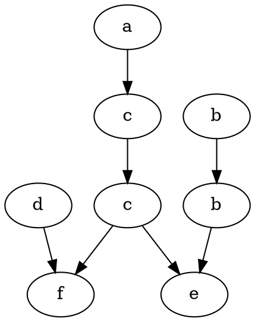

# Practical Use of Trace Theory

## Program Operation

The program computes:

* the **dependency relation D**,
* the **independency relation I**,
* the **Foata Normal Form (FNF)** of a trace,
* and the minimal **Diekert graph** for a given word `w`.

It works for any specified alphabet, set of transactions, and word `w`.

## Input Data

* **Transactions** are provided in a plaintext file (path set in `const std::string INPUT_FILE` in `main.cpp`).
  Example (`transactions.txt`):

  ```
  (a) x := y + z - c + 3d
  ```

  * `a` → one-letter transaction identifier
  * `x` → result of the transaction
  * right-hand side: arbitrary expression, but **variables must be single letters**

* **Word**: set in `const std::string WORD`

* **Alphabet**: set in `const std::set ALPHABET`

* **Output**: Diekert graph saved in `.dot` format to `OUTPUT_FILE`

## Requirements

* **CMake ≥ 3.21**
* **C++20**

## Build & Run (Linux)

```bash
mkdir build
cmake -B./build -S.
cd build
make
./trace
```

Output graph (`output.dot`) is saved in the project root.

## Project Structure

* `include/` → header files (structures, function definitions)
* `src/` → implementations
* `main.cpp` → entry point
* `CMakeLists.txt` → build configuration

## Graphs

* **Dependency graph**: undirected, vertices = transactions, edges = dependencies
* **Independency graph**: complement of the dependency graph, also undirected
* **Diekert graph**: directed, vertices = positions of transactions in the word, edges = order relations induced by dependencies

## Algorithms

* **Dependency graph**: computed by checking all pairs of transactions
* **Independency graph**: computed as complement of the dependency graph
* **Diekert graph**:

  * vertices = transactions in the word
  * edges from dependency relations
  * transitive paths removed
* **Foata Normal Form (FNF)**: obtained by BFS over the Diekert graph

## Example

### Input

Transactions:

```
(a) x := x + 1
(b) y := y + 2z
(c) x := 3x + z
(d) w := w + v
(e) z := y − z
(f) v := x + v
```

Alphabet:

```
A = {a, b, c, d, e, f}
```

Word:

```
w = acdcfbbe
```


### Output

**Dependency graph**

```
D = {(a,a), (a,c), (a,f), (c,a), (c,c), (c,e), (c,f), (f,a), (f,c), (f,d), 
     (f,f), (b,b), (b,e), (e,b), (e,c), (e,e), (d,d), (d,f)}
```

**Independency graph**

```
I = {(a,b), (a,d), (a,e), (b,a), (b,c), (b,d), (b,f), (c,b), (c,d), 
     (d,a), (d,b), (d,c), (d,e), (e,a), (e,d), (e,f), (f,b), (f,e)}
```

**Foata Normal Form (FNF)**

```
(adb)(cb)(c)(fe)
```

**Diekert graph (.dot)**


